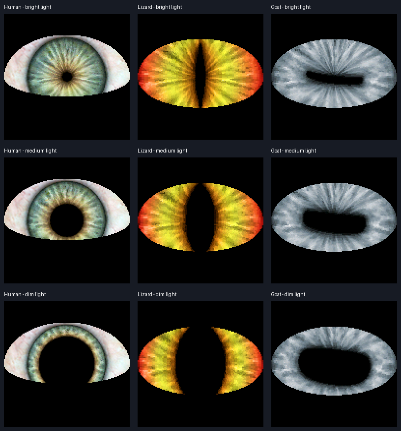

# Hallowing

Three animated eye styles with touch controls for the Adafruit HalloWing M0:
human, lizard (vertical slit), and goat (horizontal pupil). Built with Arduino
and Adafruit Uncanny Eyes, retaining the original human artwork, automatic
movement, blinking, pupil response to light, and eyelid tracking.



## Controls

Facing the screen with the fangs pointing down:

| Pad | Arduino pin | Action |
| --- | --- | --- |
| Left outer fang | A5 | Hold to look left; release to resume movement |
| Left bottom fang | A4 | One complete blink per touch |
| Right bottom fang | A3 | One complete blink per touch |
| Right outer fang | A2 | Hold to look right; release to resume movement |
| Both bottom fangs together | A4 + A3 | Hold 1.5 seconds to select the next eye style |

Holding both outer pads centers the eye. Blinking also works while a direction
is held. A touch during an existing blink queues another blink; holding a bottom
pad does not repeatedly blink or hold the eye shut.

Hold both bottom pads together to cycle **human → lizard → goat → human**.
One long hold changes style once; release both pads before cycling again.
The initial touches still blink, and a blink accompanies the style change.
The board starts with the human eye after power-on; selection is not saved to flash.

Leave pads untouched during startup calibration (about 150 ms). Touch readings
use per-pad baselines, hysteresis and debounce. If clips or conductive extensions
are added, attach them before powering on. Serial diagnostics show each pad's
raw reading, baseline, and held state, in A5/A4/A3/A2 order.

## Build and load

Requires Python 3, a C++ compiler for tests, and a USB cable that carries data.
Dependencies and Arduino CLI are installed within this checkout:

```sh
make setup
make test
make build
make memory
```

Switch the board on and **physically double-press Reset**. When the `HALLOWBOOT`
drive appears, run:

```sh
make backup
make flash
```

The output is `build/Hallowing-touch.uf2`. Flashing validates the board model and
application address range, leaves the bootloader alone, and restarts the board.
It does not touch the separate SPI flash. Do not use Arduino's 1200-baud software
reset before making backups: it can erase the first application row on this M0.
See [original firmware and recovery notes](docs/firmware-backup.md) for the initial
backup limitation and the stock-demo recovery option.

```sh
make monitor PORT=/dev/cu.usbmodem1101
```

If the bootloader serial port appears but its drive does not mount, use
`make flash-serial PORT=/dev/cu.usbmodem1101`. This uses the SAMD21 bootloader's
application region and verifies the written firmware before restarting.
In the serial monitor, `?` reports the selected eye and `n` advances one style
through the same path as the long-press gesture (useful for bench checks).

USB port names can change. Override the bootloader volume with
`make flash VOLUME=/path/to/HALLOWBOOT` on another OS. This firmware targets the
**M0**, not the M4.

## Memory and artwork

The M0 has 256 KiB internal flash, of which 8 KiB is reserved for its bootloader,
and 32 KiB RAM. The separate 8 MB SPI flash is untouched.
The original single-eye build used 202,192 bytes of application flash, leaving
51,760 bytes (50.5 KiB). The three-eye build leaves about **12.3 KiB of program
flash** and **26.5 KiB RAM before stack and heap**; run `make memory` for exact
figures from your build. UF2 file size includes packaging overhead and is not
the amount of microcontroller flash consumed.

The verified build uses 241,392 of 253,952 application-flash bytes and 5,596 bytes
of static RAM. It leaves 12,560 flash bytes and 27,172 RAM bytes before stack/heap.
Measured animation is about 16 fps across the three styles (the uncompressed,
single-eye version ran around 32 fps). Compression trades some rendering speed
for enough flash to keep all three eyes on the M0.

The human eye is pixel-identical to the previous artwork. Sclera, eyelid and
pupil-coordinate rows are compressed losslessly and expanded one scanline at
a time. The new reptile and goat iris textures are reduced to 256×32 RGB565,
with 128×128 pupil maps, to fit alongside it. `make assets` rebuilds the committed
tables from the original source headers, without network access or image libraries.
To regenerate the visual preview: `uv run --with pillow python tools/preview_eyes.py`.

## Validation

The firmware compiles for `adafruit:samd:adafruit_hallowing`. Automated checks cover
touch noise/debounce, long holds, release/retrigger, invalid measurements, timer
rollover, long-press timing/release/rearm, and UF2 validation. Every decoded artwork
pixel is compared against its source, and the row decoder runs under address and
undefined-behavior sanitizers. The attached board has successfully cycled through
all three styles via serial commands, with all four touch sensors reporting normally.
The user previously verified directional touch, release-to-resume, and both blink pads.
The new long-press gesture still needs its physical check on the board.

Source attribution is in [THIRD_PARTY.md](THIRD_PARTY.md).
